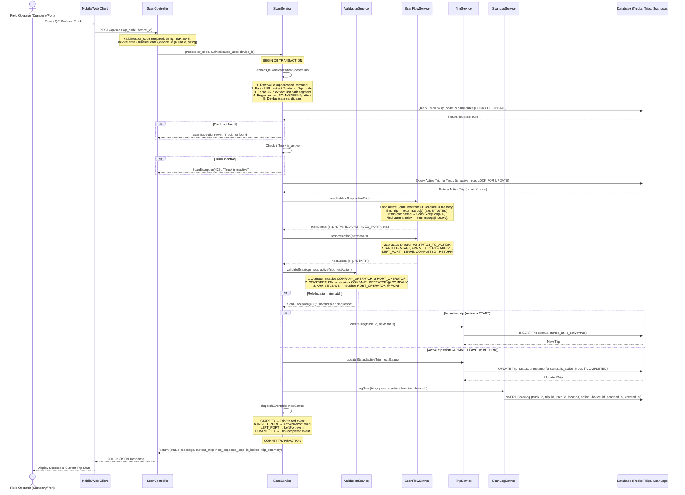
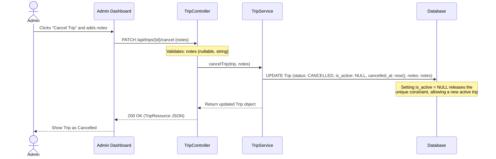
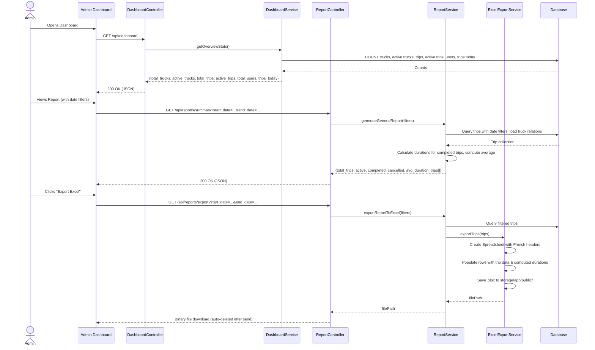
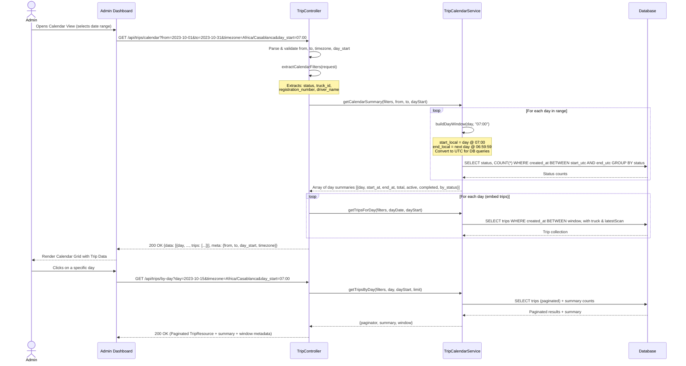
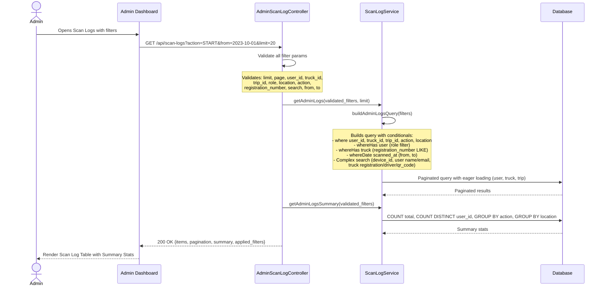
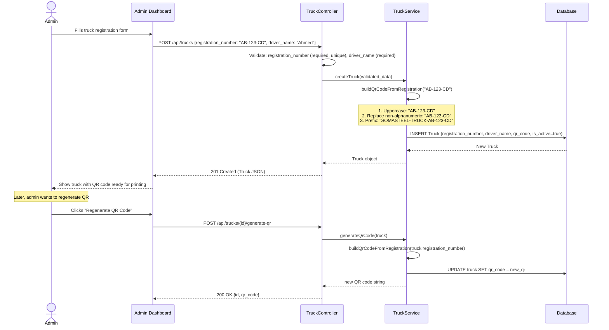
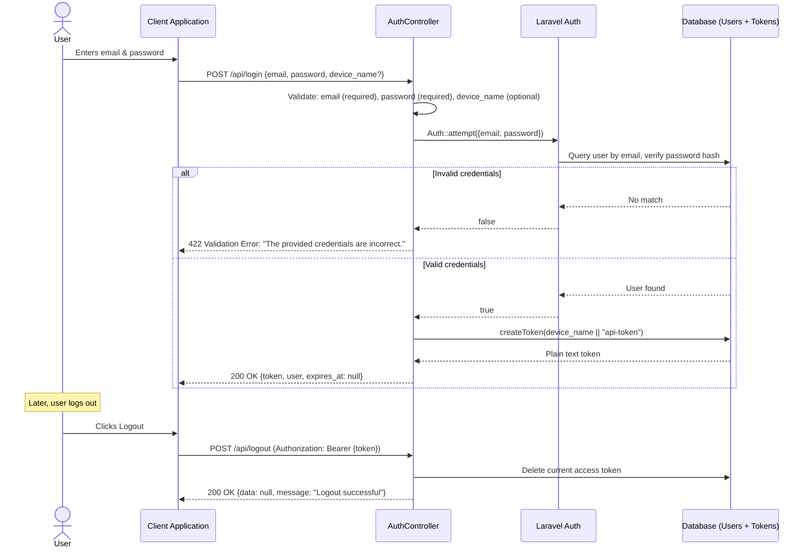

# Sequence Diagrams

## 1. The Core Scan Feature Flow

This sequence diagram illustrates what happens when an operator scans a QR code via the `/api/scan` endpoint. The system acts as a state machine; the operator merely submits the QR code, and the backend resolves the correct contextual action based on the truck's current state and the operator's location/role.

## 2. Trip Cancellation Flow

Sometimes, a trip cannot be completed (e.g., due to a truck breakdown or accident). This diagram shows the admin intervention process to clear the truck's state.

## 3. Dashboard & Reporting Flow

Admins access the dashboard and reporting system for real-time overview and historical analytics.

## 4. Calendar View Flow

The admin calendar feature provides a multi-day overview with drill-down capability.

## 5. Admin Scan Log Auditing Flow

## 6. Truck Registration and QR Code Flow

## 7. User Authentication Flow

