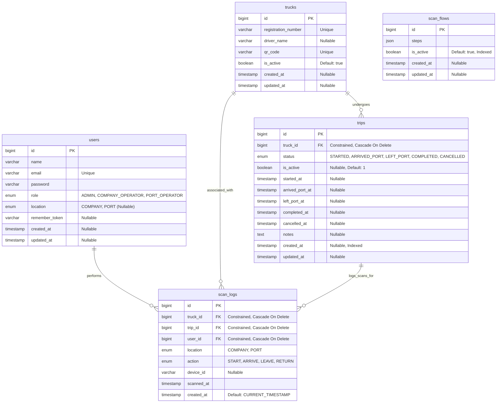

# Database Schema Specification

This document contains the comprehensive database schema specification and relationship diagram for the backend system.

## 1. Entity Relationship Diagram (ERD)

## 2. Relationships & Cardinalities Explanation

| Source Table | Destination Table | Cardinality | Explanation |
| :--- | :--- | :--- | :--- |
| `users` | `scan_logs` | `1 : 0..*` (One to Zero or Many) | A user (e.g. port or company operator) can perform multiple barcode scans over time. A scan log must be executed by exactly one user. |
| `trucks` | `trips` | `1 : 0..*` (One to Zero or Many) | A truck can perform many trips over its lifetime. Each trip is assigned to exactly one truck. |
| `trucks` | `scan_logs` | `1 : 0..*` (One to Zero or Many) | A truck gets scanned at various checkpoints, accumulating scan logs. |
| `trips` | `scan_logs` | `1 : 0..*` (One to Zero or Many) | A trip has a workflow of scan events (e.g. START, ARRIVE, LEAVE). Each scan log maps back to the specific trip context. |

## 3. Database Integrity & Constraints

1. **Trip Active Uniqueness per Truck (`trips`)**:
   - Index name: `trips_truck_id_is_active_unique`
   - Columns: `(truck_id, is_active)`
   - **Rationale**: Ensures a single truck can only have **at most one active trip** at any given time (`is_active` = `1`). Because MySQL allows multiple `NULL` values in a unique index, completed or cancelled trips have `is_active` updated to `NULL` (via DB migrations), allowing new active trips to be started.

2. **Scan Log Workflow Uniqueness (`scan_logs`)**:
   - Index name: Composite unique constraint on `(trip_id, action, scanned_at)`
   - **Rationale**: Prevents duplicate scan event entries for the same trip, action, and timestamp.
