# Database Schema Specification

This document contains the comprehensive database schema specification and relationship diagram for the backend system.

## 1. Entity Relationship Diagram (ERD)

```mermaid
erDiagram
    users {
        bigint id PK
        varchar name
        varchar email "Unique"
        varchar password "Hashed (bcrypt)"
        enum role "ADMIN, COMPANY_OPERATOR, PORT_OPERATOR"
        enum location "COMPANY, PORT (Nullable)"
        varchar remember_token "Nullable"
        timestamp created_at "Nullable"
        timestamp updated_at "Nullable"
    }

    trucks {
        bigint id PK
        varchar registration_number "Unique"
        varchar driver_name "Nullable"
        varchar qr_code "Unique, auto-generated: SOMASTEEL-TRUCK-{REG}"
        boolean is_active "Default: true"
        timestamp created_at "Nullable"
        timestamp updated_at "Nullable"
    }

    trips {
        bigint id PK
        bigint truck_id FK "Constrained, Cascade On Delete"
        enum status "STARTED, ARRIVED_PORT, LEFT_PORT, COMPLETED, CANCELLED"
        boolean is_active "Nullable, Default: 1, set to NULL on completion/cancel"
        timestamp started_at "Nullable"
        timestamp arrived_port_at "Nullable"
        timestamp left_port_at "Nullable"
        timestamp completed_at "Nullable"
        timestamp cancelled_at "Nullable"
        text notes "Nullable"
        timestamp created_at "Nullable, Indexed"
        timestamp updated_at "Nullable"
    }

    scan_logs {
        bigint id PK
        bigint truck_id FK "Constrained, Cascade On Delete"
        bigint trip_id FK "Constrained, Cascade On Delete"
        bigint user_id FK "Constrained, Cascade On Delete"
        enum location "COMPANY, PORT"
        enum action "START, ARRIVE, LEAVE, RETURN"
        varchar device_id "Nullable"
        timestamp scanned_at "Not null"
        timestamp created_at "Default: CURRENT_TIMESTAMP"
    }

    scan_flows {
        bigint id PK
        json steps "Array of status strings"
        boolean is_active "Default: true, Indexed"
        timestamp created_at "Nullable"
        timestamp updated_at "Nullable"
    }

    personal_access_tokens {
        bigint id PK
        varchar tokenable_type
        bigint tokenable_id "Polymorphic FK to users"
        varchar name
        varchar token "Unique, SHA-256 hash"
        text abilities "Nullable"
        timestamp last_used_at "Nullable"
        timestamp expires_at "Nullable"
        timestamp created_at "Nullable"
        timestamp updated_at "Nullable"
    }

    cache {
        varchar key PK
        mediumtext value
        int expiration
    }

    cache_locks {
        varchar key PK
        varchar owner
        int expiration
    }

    jobs {
        bigint id PK
        varchar queue "Indexed"
        longtext payload
        tinyint attempts
        int reserved_at "Nullable"
        int available_at
        int created_at
    }

    job_batches {
        varchar id PK
        varchar name
        int total_jobs
        int pending_jobs
        int failed_jobs
        longtext failed_job_ids
        mediumtext options "Nullable"
        int cancelled_at "Nullable"
        int created_at
        int finished_at "Nullable"
    }

    failed_jobs {
        bigint id PK
        varchar uuid "Unique"
        text connection
        text queue
        longtext payload
        longtext exception
        timestamp failed_at "Default: CURRENT_TIMESTAMP"
    }

    sessions {
        varchar id PK
        bigint user_id FK "Nullable, Indexed"
        varchar ip_address "Nullable"
        text user_agent "Nullable"
        longtext payload
        int last_activity "Indexed"
    }

    users ||--o{ scan_logs : "performs"
    trucks ||--o{ trips : "undergoes"
    trucks ||--o{ scan_logs : "associated_with"
    trips ||--o{ scan_logs : "logs_scans_for"
    users ||--o{ personal_access_tokens : "owns"
```

## 2. Relationships & Cardinalities Explanation

| Source Table | Destination Table | Cardinality | Explanation |
| :--- | :--- | :--- | :--- |
| `users` | `scan_logs` | `1 : 0..*` (One to Zero or Many) | A user (e.g. port or company operator) can perform multiple barcode scans over time. A scan log must be executed by exactly one user. |
| `trucks` | `trips` | `1 : 0..*` (One to Zero or Many) | A truck can perform many trips over its lifetime. Each trip is assigned to exactly one truck. |
| `trucks` | `scan_logs` | `1 : 0..*` (One to Zero or Many) | A truck gets scanned at various checkpoints, accumulating scan logs. |
| `trips` | `scan_logs` | `1 : 0..*` (One to Zero or Many) | A trip has a workflow of scan events (e.g. START, ARRIVE, LEAVE, RETURN). Each scan log maps back to the specific trip context. |
| `users` | `personal_access_tokens` | `1 : 0..*` (One to Zero or Many) | A user can have multiple API tokens (one per device/session). Managed by Laravel Sanctum. |

## 3. Eloquent Model Relationships

| Model | Relationship | Type | Target | Description |
| :--- | :--- | :--- | :--- | :--- |
| `User` | `scanLogs()` | HasMany | `ScanLog` | All scans performed by this user. |
| `Truck` | `trips()` | HasMany | `Trip` | All trips ever taken by this truck. |
| `Truck` | `scanLogs()` | HasMany | `ScanLog` | All scan events involving this truck. |
| `Truck` | `activeTrip()` | HasOne (filtered) | `Trip` | The single currently active trip (`is_active = true`). Returns `null` if none. |
| `Trip` | `truck()` | BelongsTo | `Truck` | The truck performing this trip. |
| `Trip` | `scanLogs()` | HasMany | `ScanLog` | All scan events within this trip. |
| `Trip` | `latestScan()` | HasOne (latestOfMany) | `ScanLog` | The most recent scan by `scanned_at`. Used for `last_scan_at` display. |
| `ScanLog` | `truck()` | BelongsTo | `Truck` | The truck that was scanned. |
| `ScanLog` | `trip()` | BelongsTo | `Trip` | The trip context of this scan. |
| `ScanLog` | `user()` | BelongsTo | `User` | The operator who performed the scan. |

## 4. Database Integrity & Constraints

### 4.1. Trip Active Uniqueness per Truck (`trips`)
- **Index name**: `trips_truck_id_is_active_unique`
- **Columns**: `(truck_id, is_active)`
- **Rationale**: Ensures a single truck can only have **at most one active trip** at any given time (`is_active` = `1`). Because MySQL allows multiple `NULL` values in a unique index, completed or cancelled trips have `is_active` updated to `NULL` (via `TripService::updateStatus()` and `TripService::cancelTrip()`), allowing new active trips to be started.

### 4.2. Scan Log Workflow Uniqueness (`scan_logs`)
- **Index name**: Composite unique constraint on `(trip_id, action, scanned_at)`
- **Rationale**: Prevents duplicate scan event entries for the same trip, action, and timestamp.

### 4.3. Started At Index (`trips`)
- **Index name**: Index on `started_at`
- **Added in**: Migration `2026_05_18_120000_add_started_at_index_to_trips_table`
- **Rationale**: Optimizes queries that filter or sort by trip start time (used in reporting and calendar views).

### 4.4. Created At Index (`trips`)
- **Index name**: Index on `created_at`
- **Rationale**: Optimizes pagination queries (most trip listings order by `id DESC` and filter by `created_at` date ranges).

### 4.5. Scan Flow Active Index (`scan_flows`)
- **Index name**: Index on `is_active`
- **Rationale**: The `ScanFlowService` queries `WHERE is_active = true ORDER BY id DESC LIMIT 1` on every scan operation.

### 4.6. Foreign Key Cascade Policies
- All foreign keys use `CASCADE ON DELETE`:
  - Deleting a **truck** cascades to all its trips and scan logs.
  - Deleting a **trip** cascades to all its scan logs.
  - Deleting a **user** cascades to all their scan logs.

## 5. Migration History

| Migration | Description |
| :--- | :--- |
| `0001_01_01_000000_create_users_table.php` | Creates `users`, `password_reset_tokens`, and `sessions` tables. Users table includes `role` and `location` enum columns. |
| `0001_01_01_000001_create_cache_table.php` | Creates `cache` and `cache_locks` tables for Laravel's cache system. |
| `0001_01_01_000002_create_jobs_table.php` | Creates `jobs`, `job_batches`, and `failed_jobs` tables for Laravel's queue system. |
| `2026_03_24_110931_create_personal_access_tokens_table.php` | Creates `personal_access_tokens` table for Laravel Sanctum. |
| `2026_03_24_111226_create_trucks_table.php` | Creates `trucks` table with `registration_number` (unique), `qr_code` (unique), `is_active`. |
| `2026_03_24_111227_create_trips_table.php` | Creates `trips` table with `truck_id` FK, `status` enum, `is_active`, timestamps for each state, and `created_at` index. |
| `2026_03_24_111228_create_scan_logs_table.php` | Creates `scan_logs` table with FKs to `trucks`, `trips`, `users`; `location` and `action` enums; composite unique on `(trip_id, action, scanned_at)`. |
| `2026_03_26_120000_fix_trip_active_uniqueness_per_truck.php` | Adds the `(truck_id, is_active)` unique index to prevent multiple active trips per truck. |
| `2026_03_27_000001_add_driver_name_to_trucks_table.php` | Adds `driver_name` column to `trucks` table. |
| `2026_03_29_000002_drop_driver_name_unique_on_trucks_table.php` | Drops any unique constraint on `driver_name` (it was incorrectly added). |
| `2026_04_28_120000_create_scan_flows_table.php` | Creates `scan_flows` table with `steps` (JSON), `is_active` (indexed). |
| `2026_05_18_120000_add_started_at_index_to_trips_table.php` | Adds index on `trips.started_at` for reporting query optimization. |
| `2026_06_07_163627_add_notes_and_cancelled_to_trips.php` | Adds `notes` (text, nullable) and `cancelled_at` (timestamp, nullable) columns to `trips`. |
| `2026_06_09_165000_update_status_enum_on_trips_table.php` | Updates the `status` enum to include `CANCELLED` as a valid value. |

## 6. Model Attribute Casts

| Model | Attribute | Cast | Notes |
| :--- | :--- | :--- | :--- |
| `User` | `password` | `hashed` | Auto-hashes on write via Laravel's `hashed` cast. |
| `Truck` | `is_active` | `boolean` | |
| `Trip` | `is_active` | `boolean` | |
| `Trip` | `started_at` | `datetime` | Carbon instance. |
| `Trip` | `arrived_port_at` | `datetime` | Carbon instance. |
| `Trip` | `left_port_at` | `datetime` | Carbon instance. |
| `Trip` | `completed_at` | `datetime` | Carbon instance. |
| `Trip` | `cancelled_at` | `datetime` | Carbon instance. |
| `ScanLog` | `scanned_at` | `datetime` | Carbon instance. |
| `ScanLog` | `created_at` | `datetime` | Carbon instance. Note: `$timestamps = false` on this model — `created_at` is manually set. |
| `ScanFlow` | `steps` | `array` | JSON column cast to PHP array. |
| `ScanFlow` | `is_active` | `boolean` | |

## 7. Seeders

| Seeder | Description |
| :--- | :--- |
| `DatabaseSeeder` | Orchestrator that calls `AdminAndTruckSeeder` and `TruckInitialDataSeeder`. |
| `AdminAndTruckSeeder` | Seeds the initial admin user and a small set of sample trucks with auto-generated QR codes. |
| `TruckInitialDataSeeder` | Seeds a larger batch of trucks with real-world-like registration numbers and driver names. |
